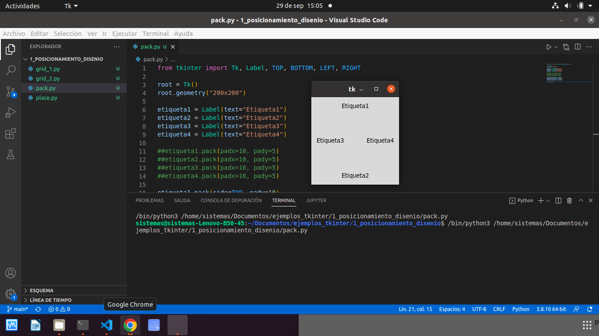
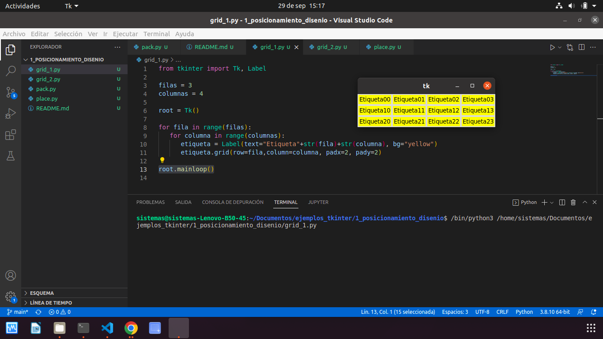
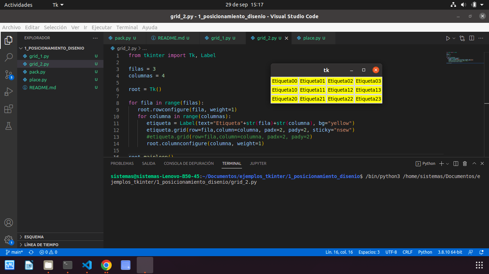
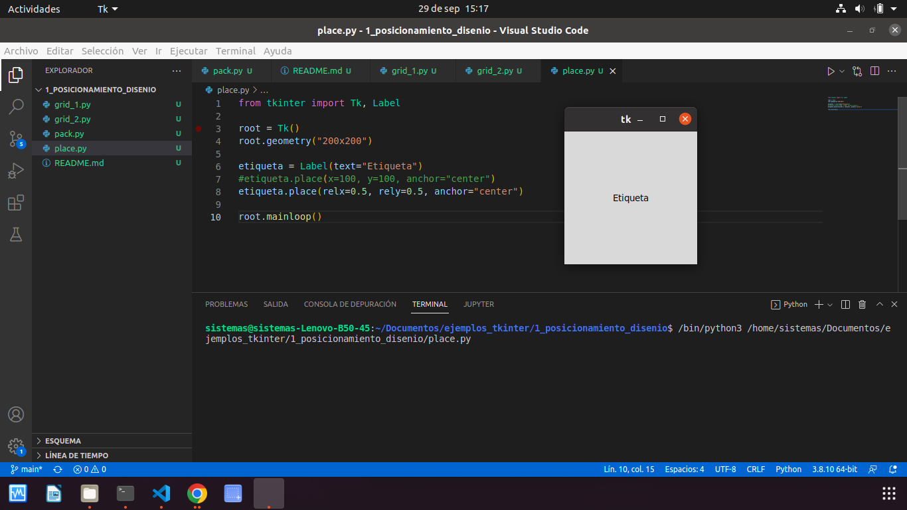

# 1. POSICIONAMIENTO Y DISEÑO

## gestor de geometria pack

#### Este gestor de geometria distribuye los widgets en horizontal o en vertical

## Gestor de geometria grid

#### con grid la distribucion de los widgets se realiza de una manera mas flexible, utilizando un diseño de cuadricula. De esta manerra, cada widget en la celda determinada por la interseccion de una fila y una columna.

## Gestor de Geometria place

#### Este gestor permite permite colocar

